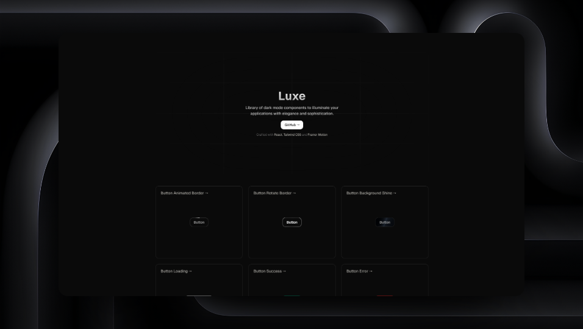

### Luxe

Explore the new website that simplifies the creation of sophisticated dark mode components. With React, Tailwind CSS and Framer Motion, easily achieve an elegant and modern aesthetic in your digital projects.

<a href="https://luxe.guhrodrigues.com">
  See the website
</a>

### How to use?

Simply click on a component, copy the code and paste it into your project. This will give your application extra sophistication!

### Inspiration

My biggest inspiration for creating components comes from looking at [Vercel](https://vercel.com/home) websites, such as [Next.js](https://nextjs.org), which is fascinating when it comes to user experience.

I would like to thank [ui.ibelick](https://ui.ibelick.com), who was a fundamental inspiration for the creation of this project.

### Future plans

I was very excited to develop this project, it's a great satisfaction to be creating it, I intend to continue and add more and more components and make web development easier.

### License

© Gustavo Rodrigues – All rights reserved. Licensed under the [MIT LICENSE](https://github.com/guhrodriguess/luxe/blob/main/LICENSE).
